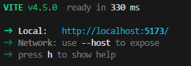

# O QUE É REACT?

React é um framework JavaScript criado pelo Facebook (atual Meta) que é utilizado para criar interfaces de usuário (UI) em aplicativos web. Ele é popular por ser fácil de usar, altamente flexível e escalável, utilizado em diversas empresas.

# BASE UTILIZADA
**Link:** <a href="https://jsonplaceholder.typicode.com/users" target="_blank">{JSON} Placeholder</a>

# PROPOSTA
Pegar dados de usuários através da URL que possui um JSON com a proposta referida.

# COMO EXECUTAR O PROJETO?
Primeiro digite no terminal **"cd react-campinho"**

Após isso, estando dentro do repositório, digite **npm run dev**

Isto irá gerar a seguinte imagem: 

Clicando **"CTRL + ENTER"** abrirá o servidor com o projeto executando.

# TECNOLOGIAS UTILIZADAS
<h2>Javascript</h2>

<h2>Node</h2>

<h2>React</h2>

